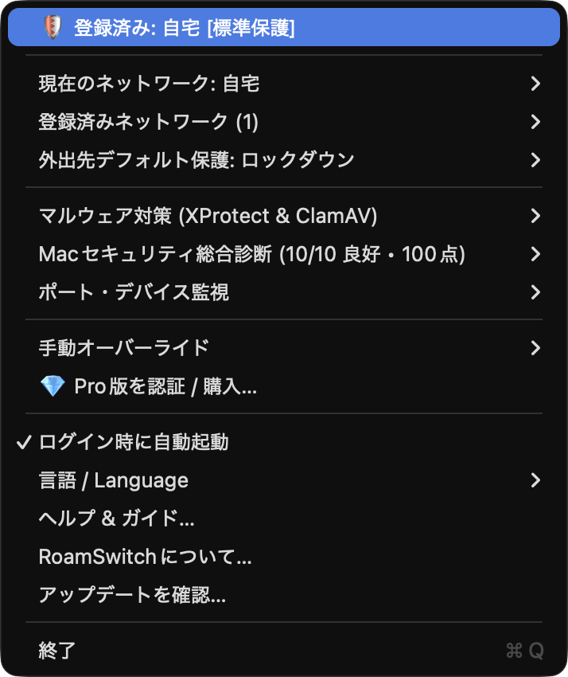

<!-- Language: [English](README.md) | **日本語** -->

# RoamSwitch — サポート & お知らせ

[English](README.md) | **日本語**

Macのネットワーク境界を自律的に守るメニューバーアプリ。RoamSwitch は、信頼できる
ネットワーク（自宅LAN・職場・テザリング等）をデフォルトゲートウェイの MAC アドレスで
認識し、接続先が変わった瞬間に macOS のファイアウォール・ステルスモード・共有サービス
（SSH / SMB / 画面共有）・AirDrop のポリシーを自動で切り替えます。

> このリポジトリは **ソースコードではありません**。
> **ダウンロード・リリースノート・FAQ・プライバシーポリシー・サポート**
> （バグ報告と機能要望は [Issues](../../issues)）の公開窓口です。

<p align="center">
  
</p>

## ダウンロード

**https://lafine.net/**

- 署名・公証済みの `.dmg`（Mac App Store 外での直接配布）
- **macOS 13 Ventura 以降**（Apple silicon / Intel 対応）
- 最新バージョン: **1.7.2**

## 主な機能

| レイヤー | 無料版 | Pro 永続版 |
| :--- | :---: | :---: |
| Wi‑Fi 自動検知 & カーネルパケット遮断 (`pf`) | ✅ | ✅ |
| プロファイル別セキュリティレベル（信頼 / 標準 / ロックダウン） | ✅ | ✅ |
| SSH / SMB / 画面共有 / AirDrop の自動停止・復元 | ✅ | ✅ |
| Mac セキュリティ診断（FileVault / SIP / Gatekeeper / 自動更新） | ✅ 手動 | ✅ + バックグラウンド自律巡回 |
| マルウェア対策（XProtect / ClamAV の状態監査・スキャン） | ✅ 手動 | ✅ + ウイルス定義自動更新 |
| Wi‑Fi 暗号化強度警告・ARPスプーフィング検知・公開ポート/USB 監視 | ✅ | ✅ |
| 🚨 ランサムウェア様の暗号化活動検知 → 緊急 Air‑Gap 遮断 (`pf`) | ❌ | 🚀 |
| 🛡️ 開発サーバー & ローカルAIサーバー（Ollama/LM Studio等）の `0.0.0.0` 露出隔離ガード | ❌（一覧のみ） | 🚀 ワンクリック遮断 |
| 🕳️ ポート異常検知ガード（新規公開リスニングポートを自動遮断・シグネチャ不要） | ❌ | 🚀 |
| ⚡ ARPスプーフィング自動対応 + リアルタイム通知 | ❌（メニュー表示のみ） | 🚀 |
| 🔌 不正 USB / BadUSB ストレージガード + マウント時 ClamAV 自動スキャン | ❌ | 🚀 |
| 🌐 Web・メールダウンロード保護（Pickle形式AIモデル検知対応） / DNS 脅威保護 / リンク安全性診断 | ❌ | 🚀 |
| 🔑 APIキー・シークレット漏洩チェッカー（完全ローカル・クリップボード保護） | ✅ | ✅ |
| 📄 ログ・診断結果のエクスポート（CSV / JSON） | ❌ | 🚀 |
| 利用可能台数 | 1 台 | 2 台 |

## 価格

買い切り（サブスクリプションではありません）。

| プラン | 価格（税込） | 台数 |
| :--- | :--- | :--- |
| **Free（無料版）** | ¥0 | 1 台 |
| **Pro Lifetime** | **¥2,980** | 2 台 |

Pro は永続ライセンス・アップデート無償。購入は **https://lafine.net/** から。

## プライバシー — Zero Telemetry

RoamSwitch は **アプリ自身による外部ネットワーク通信を一切行いません**。
アナリティクス・クラッシュレポート・ライセンスの常時通信はありません
（購入時の Web 決済のみ）。同梱の MCP サーバーは読み取り専用でローカル stdio のみを
使用します。詳細は [docs/PRIVACY.ja.md](docs/PRIVACY.ja.md)。

## MCP サーバー連携（Claude Desktop / Claude Code）

RoamSwitch には **読み取り専用** の MCP（Model Context Protocol）サーバーが同梱され、
MCP 対応クライアントから Mac のセキュリティ状況を問い合わせられます。ロックダウン切替・
隔離・取り出しなどの操作系ツールは含まれません。

```sh
claude mcp add roamswitch /Applications/RoamSwitch.app/Contents/MacOS/RoamSwitchMCPServer
```

提供ツール: `get_security_report` / `get_exposed_ports` / `get_guard_status` / `audit_url_safety` / `get_app_help`

MCP サーバーと、その検知ロジックは **オープンソース**（MIT）です：
[github.com/lafine1211/roamswitch-mcp](https://github.com/lafine1211/roamswitch-mcp)。
`swift test` で単体・敵対的入力・ミューテーションファジングを実行できます。

## RoamSwitch for Linux

**Linux**（systemd + nftables）向けの別エディションが、同じゼロトラスト思想を再現しています。
ゲートウェイ MAC による `nftables` プロファイルの自律切替、ランサムウェアの挙動検知と
緊急 Air‑Gap 隔離、不正 USB / BadUSB ガード、20 項目のセキュリティ診断、読み取り専用の
MCP サーバーを同梱します。

- **無償「Community Edition」**、全機能開放、ライセンス認証不要。プロプライエタリ・
  フリーウェア（同梱 EULA）。ソースは公開していません。
- **ダウンロード・ドキュメント:** <https://lafine.net/linux>
- **導入:** APT（`lafine.net/apt`）、DNF / zypper（`lafine.net/rpm`）。Arch は同梱
  PKGBUILD からビルド（AUR `roamswitch-bin` は準備中）。Ubuntu 22.04+ / Debian 12+
  など systemd + nftables のディストロが必要。x86_64 / aarch64（Raspberry Pi 4 / 5 を含む）。
- **セキュリティ設計書:** <https://lafine.net/linux/whitepaper> — 「外部送信データゼロ」の
  コードレベル監査と破壊的セルフテストの結果
  （[audit/RESULTS-LINUX-2026-09-02.ja.md](audit/RESULTS-LINUX-2026-09-02.ja.md)）を収録。
- **RoamSwitch Business**（有償・準備中）は、組織向けにフリート集中管理・署名付きポリシー配布・
  署名済み社内 APT リポジトリ・SLA サポートを追加します: <https://lafine.net/business>。
  macOS 版の **Pro Lifetime** をお持ちの方には、ご本人所有の Linux 端末で Business 機能を
  無償付与します。
- **サポート:** 同じ [Issues](../../issues) をご利用ください。Linux の報告にはラベルを付け、
  `journalctl -u roamswitch -b` と `roamswitch status` の出力（要マスキング）を添付してください。

## セキュリティと検証

- **アーキテクチャ／セキュリティ設計書** — RoamSwitch がどんな権限を持ち、その境界で何をしているかを、
  出荷バイナリと照合できる粒度で：
  [docs/WHITEPAPER.ja.md](docs/WHITEPAPER.ja.md)（[English](docs/WHITEPAPER.md)）·
  整形版 <https://lafine.net/security.html>
- **[`verify.sh`](verify.sh)** — 設計書 付録 A のチェックを、インストール済みのアプリに対して実行します
  （署名・公証・entitlements・MCP サーバーのオフライン応答・pf の状態）。約 90 行の読み取り専用シェルです。
  中身を読んでから：

  ```sh
  git clone https://github.com/lafine1211/roamswitch-support && cd roamswitch-support
  ./verify.sh            # sudo を使う 2 ステップを飛ばすなら NO_SUDO=1
  ```
- **[`audit/`](audit/)** — より重い、繰り返し可能な **Zero Telemetry 外向き通信の監査**。
  トラフィックをキャプチャしてプロセス単位で帰属し、RoamSwitch のバイナリからの外向き接続が
  設計書 §7 の4経路だけであることを確かめます。直近の実測：[**PASS・2026-08-29**](audit/RESULTS-2026-08-29.ja.md)。
  `./audit/rs-zerotel-audit.sh all` で再現できます。
- 脆弱性の報告: <https://lafine.net/.well-known/security.txt>

## サポート

- **バグ報告・機能要望:** [Issue](../../issues) を作成（テンプレートあり）
- **質問・雑談:** [Discussions](../../discussions)
- リリースノート: [CHANGELOG.ja.md](CHANGELOG.ja.md) ／ ヘルプ: [docs/FAQ.ja.md](docs/FAQ.ja.md)

Issue は日本語・英語どちらでも構いません。

## リンク

- Web サイト・ダウンロード: https://lafine.net/
- [FAQ](docs/FAQ.ja.md) ／ [プライバシーポリシー](docs/PRIVACY.ja.md) ／ [変更履歴](CHANGELOG.ja.md)

---

RoamSwitch はプロプライエタリソフトウェアです。© Lafine Systems Design.
本リポジトリのドキュメントはアプリの説明・サポート目的で引用可能です。
