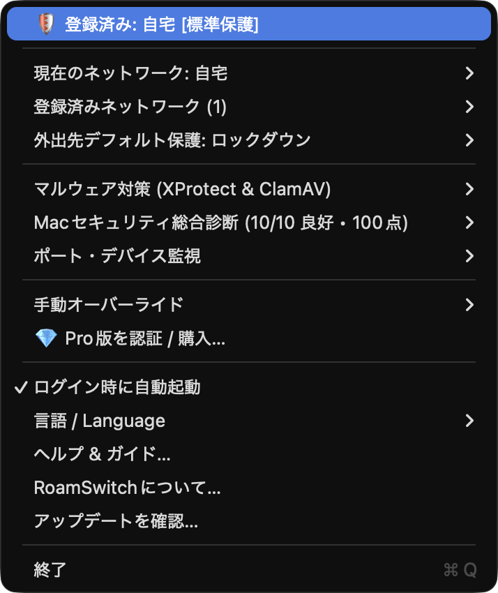

<!-- Language: [English](README.md) | **日本語** -->

# RoamSwitch — サポート & お知らせ

[English](README.md) | **日本語**

Macのネットワーク境界を自律的に守るメニューバーアプリ。RoamSwitch は、信頼できる
ネットワーク（自宅LAN・職場・テザリング等）をデフォルトゲートウェイの MAC アドレスで
認識し、接続先が変わった瞬間に macOS のファイアウォール・ステルスモード・共有サービス
（SSH / SMB / 画面共有）・AirDrop のポリシーを自動で切り替えます。

> このリポジトリは **ソースコードではありません**。
> **ダウンロード・リリースノート・FAQ・プライバシーポリシー・サポート**
> （バグ報告と機能要望は [Issues](../../issues)）の公開窓口です。

<p align="center">
  
</p>

## ダウンロード

**https://roamswitch.com/**

- 署名・公証済みの `.dmg`（Mac App Store 外での直接配布）
- **macOS 13 Ventura 以降** / Apple silicon 専用（M1 / M2 / M3 / M4 以降）
- 最新バージョン: **1.11.2**

## 主な機能

| レイヤー | 無料版 | Pro 永続版 |
| :--- | :---: | :---: |
| Wi‑Fi 自動検知 & カーネルパケット遮断 (`pf`) | ✅ | ✅ |
| プロファイル別セキュリティレベル（信頼 / 標準 / ロックダウン） | ✅ | ✅ |
| SSH / SMB / 画面共有 / AirDrop の自動停止・復元 | ✅ | ✅ |
| Mac セキュリティ総合診断 18 項目（FileVault / SIP / Gatekeeper / 自動更新 / XProtect / ファイアウォール / ステルス / Wi‑Fi 暗号化 / ARP / SSH / sudo / 公開ポート / ダウンロード・DNS・リンク保護 / USB・アクセサリ防御） | ✅ 手動 | ✅ + バックグラウンド自律巡回 |
| マルウェア対策（XProtect / ClamAV の状態監査・スキャン） | ✅ 手動 | ✅ + ウイルス定義自動更新 |
| Wi‑Fi 暗号化強度警告・ARPスプーフィング検知・公開ポート/USB 監視 | ✅ | ✅ |
| 🚨 ランサムウェア様の暗号化活動検知 → 緊急 Air‑Gap 遮断 (`pf`) | ❌ | 🚀 |
| 🛡️ 開発サーバー & ローカルAIサーバー（Ollama/LM Studio等）の `0.0.0.0` 露出隔離ガード | ❌（一覧のみ） | 🚀 ワンクリック遮断 |
| 🕳️ ポート異常検知ガード（新規公開リスニングポートを自動遮断・シグネチャ不要） | ❌ | 🚀 |
| ⚡ ARPスプーフィング自動対応 + リアルタイム通知 | ❌（メニュー表示のみ） | 🚀 |
| 🔌 不正 USB / BadUSB ストレージガード + マウント時 ClamAV 自動スキャン | ❌ | 🚀 |
| 🌐 Web・メールダウンロード保護（Pickle形式AIモデル検知対応） / DNS 脅威保護 / リンク安全性診断 | ❌ | 🚀 |
| 🔑 APIキー・シークレット漏洩チェッカー（完全ローカル・クリップボード保護） | ✅ | ✅ |
| 🧬 ランタイム脅威封じ込め（Apple XProtect がマルウェアを検知した瞬間に自動 Air‑Gap） | ❌ | 🚀 |
| 🪤 ランサムウェア・カナリア（おとりファイル）＋インシデント履歴 | ❌ | 🚀 |
| 🔒 VPN トンネル + キルスイッチ（WireGuard / Tailscale）を未信頼ネットで自動確立 | ❌ | 🚀 |
| 🎣 リンク保護（`/etc/hosts` シンクホール＋コンテンツフィルタ機能拡張でフィッシング接続を遮断） | ❌ | 🚀 |
| 🧩 永続化監視（新規 LaunchAgent/Daemon）・ClickFix シェル履歴ガード | ❌ | 🚀 |
| 📂 クリティカルパス FIM（root 専用システムファイルの SHA‑256 ベースラインをバックグラウンド検証） | ❌ | 🚀 |
| 🧾 セキュリティログ監査（機密情報の自動マスキング＋ログテンプレート異常検知） | ✅ | ✅ |
| 🧯 統合インシデントタイムライン・通知履歴（直近 7 日） | ✅ | ✅ |
| 🐞 Homebrew formula / 依存ロックファイルのローカル CVE 照合（通信なし） | ✅ | ✅ |
| 🧪 実証型脆弱性検証（`127.0.0.1` 限定・オプトイン・既定 OFF） | ✅ | ✅ |
| 📄 ログ・診断結果のエクスポート（CSV / JSON） | ❌ | 🚀 |
| 利用可能台数 | 1 台 | 2 台 |

## 価格

買い切り（サブスクリプションではありません）。

| プラン | 価格（税込） | 台数 |
| :--- | :--- | :--- |
| **Free（無料版）** | ¥0 | 1 台 |
| **Pro Lifetime** | **¥2,980** | 2 台 |

Pro は永続ライセンス・アップデート無償。購入は **https://roamswitch.com/** から。

## プライバシー — Zero Telemetry

RoamSwitch には **テレメトリがありません**。利用状況・診断結果・アナリティクス・
クラッシュレポートを収集も送信もしません。機能に必要な最小限の通信は行い、設計書と
[プライバシーポリシー](https://lafine.net/privacy.html) で公開しています。Mac 版では次のとおりです。

- 更新の確認（Sparkle の appcast。起動時と 24 時間ごと、全ユーザー）
- ライセンス認証（キーを入力したときだけ）
- リンクガードの署名つき脅威フィード（Pro）
- パッケージの CVE データ（全ユーザー、約 30 日に 1 回取得）
- ClamAV 定義の更新（Pro、自動）
- DNS 脅威ガード（Pro。システムの DNS リゾルバーを切り替えます）
- 使ったときだけ動くもの（リンク安全性診断での短縮 URL の展開は対象の URL へ直接アクセス、
  Sensor・VPN 機能、npm の署名確認）

購入時の決済は Web サイト上で行います。同梱の MCP サーバーは読み取り専用でローカル stdio のみを
使用します（ネットワーク動作は下の MCP の節に記載）。直近の外向き通信の実測（[`audit/`](audit/)）は
2026-08-29 の 1.4.7 で、これらの経路の一部より前のものです。

Linux の Server Edition は、既定では、OS のパッケージ更新と、カーネル CVE マップのための
署名つき・受信専用・匿名の HTTPS GET（lafine.net 宛て。マニフェストの確認は毎日、データ本体の取得は約 30 日に 1 回。
1.11.0 から既定で有効。このホストの情報は送りません。`roamswitch server config set cve_kernel_map_updates_enabled false`
で無効化できます）以外の外部通信をしません。npm の署名確認や通知の Webhook などの
ほかの外部通信は、運用者が設定したときだけ有効になります。

## MCP サーバー連携（Claude Desktop / Claude Code）

RoamSwitch には **読み取り専用** の MCP（Model Context Protocol）サーバーが同梱され、
MCP 対応クライアントから Mac のセキュリティ状況を問い合わせられます。ロックダウン切替・
隔離・取り出しなどの操作系ツールは含まれません。

```sh
claude mcp add roamswitch /Applications/RoamSwitch.app/Contents/MacOS/RoamSwitchMCPServer
```

提供ツール（全 31 種・すべて読み取り専用）: `get_security_report` / `verify_security_findings` /
`get_exposed_ports` / `get_guard_status` / `audit_url_safety` / `audit_secrets` /
`audit_security_logs` / `get_app_help` / `run_active_vuln_scan` / `run_package_cve_scan` /
`run_package_cve_scan_languages` / `run_package_lifecycle_script_scan` / `run_typosquat_scan` /
`run_npm_audit_signatures` / `get_vulnerability_scan_history` / `get_quarantine_status` /
`get_canary_status` / `get_ransomware_entropy_guard_status` /
`get_ransomware_recovery_snapshots` / `get_forensic_evidence_bundles` /
`get_honeytoken_status` / `get_browser_credential_watch_status` /
`get_port_anomaly_incidents` / `get_runtime_threat_status` / `get_incident_timeline` /
`search_exec_events` / `get_process_tree` / `get_network_history` /
`get_sensor_audit_results` / `get_notification_history` / `audit_mcp_configs`。加えて `roamswitch://docs/*`
リソースを 4 種類提供します。インシデント状態系のツールはローカル状態のみを読むため、
Air‑Gap 隔離中でも応答します。Claude Desktop / Claude Code / Codex CLI / OpenCode /
Antigravity の設定手順は <https://roamswitch.com/mcp-setup.html>。

`verify_security_findings` は、`get_security_report` の項目（`checkId`）を今の状態で再評価し、
項目ごとに `stillPresent`（まだ該当）、`resolved`（解消、または設計上該当なし）、
`inconclusive`（判定不能）のどれかと、言語に依存しない理由コードを返します。修正のあとに
本当に直ったかを確かめるためのツールで、権限不足・特権ヘルパーの未接続・Docker に届かない
などで測れなかった項目は、安全とは報告せず `inconclusive` にします。`host_firewall` /
`network_stealth_mode` / `gateway_arp_lock` / `malware_scanning` / `dns_threat_guard` /
`usb_zero_trust` は RoamSwitch のアプリ内設定の値で合否が決まるため、アプリ内設定の反映であって、
OS の実状態の再測定ではありません。読み取り専用で、修復も設定変更もしません。

MCP サーバーのネットワーク動作: 外部のホストには接続しません。ゲートウェイの MAC アドレスを
調べるため、Mac の診断系のツールは LAN 内のゲートウェイに ICMP ping を送ることがあります
（通常は1発、MAC が引けないときは最大3回）。Linux は、診断の評価（`get_security_report` /
`verify_security_findings`）では LAN に何も送らず、MAC アドレスは ARP / neighbor テーブルと
メモリ上のキャッシュだけから取ります（Linux で ping を送るのは緊急復旧と Sensor ペアリングだけです）。
外部へ通信するのは、オプトインかつ Pro 限定の `run_npm_audit_signatures`（npm レジストリ）だけです。
`run_active_vuln_scan` は `127.0.0.1` へのプローブのみで、`get_exposed_ports` は公開ポートごとに
`127.0.0.1` へ HTTP `GET` を1回送ってヘッダを確認します。

MCP サーバーと、その検知ロジックは **オープンソース**（MIT）です：
[github.com/lafine1211/roamswitch-mcp](https://github.com/lafine1211/roamswitch-mcp)。
`swift test` で単体・敵対的入力・ミューテーションファジングを実行できます。

## RoamSwitch for Linux

**Linux**（systemd + nftables）向けの別エディションが、同じゼロトラスト思想を再現しています。
ゲートウェイ MAC による `nftables` プロファイルの自律切替、ランサムウェアの挙動検知と
緊急 Air‑Gap 隔離、不正 USB / BadUSB ガード、VPN トンネル＋nftables キルスイッチ
（WireGuard / Tailscale）、受動リンクガード、ローカル CVE 照合、27 項目のセキュリティ診断、
CLI（`roamswitch` / `man roamswitch`）、36 ツールの読み取り専用 MCP サーバーを同梱します。

パッケージは排他の 2 種類です。**Client Edition**（`roamswitch`。トレイアプリ＋Web UI、
27 項目診断）と、**Server Edition**（`roamswitch-server`。クラウド VPS・データセンター向けの
完全ヘッドレス版。インバウンド既定拒否＋SSH 締め出し防止、クリティカルパス FIM、
Falco / Tetragon 連携の eBPF 侵入検知と自律隔離、リソース枯渇ガード、
Telegram / LINE / Webhook 通知、34 項目診断）。

- **無償「Community Edition」**、全機能開放、ライセンス認証不要。プロプライエタリ・
  フリーウェア（同梱 EULA）。ソースは公開していません。
- **ダウンロード・ドキュメント:** <https://roamswitch.com/linux>
- **導入:** APT（`lafine.net/apt`）、DNF / zypper（`lafine.net/rpm`）。Arch は同梱
  PKGBUILD からビルド（AUR `roamswitch-bin` は準備中）。Ubuntu 22.04+ / Debian 12+
  など systemd + nftables のディストロが必要。x86_64 / aarch64（Raspberry Pi 4 / 5 を含む）。
- **ドキュメント:** [CLI / ヘッドレス運用](https://roamswitch.com/linux-cli.html) ·
  [Server Edition 運用マニュアル](https://roamswitch.com/linux/server-manual) ·
  [Server Edition セキュリティ設計書](https://roamswitch.com/linux/server-whitepaper)
- **Rust SDK（MIT）:** [roamswitch-linux-kit](https://github.com/lafine1211/roamswitch-linux-kit)
- **セキュリティ設計書:** <https://roamswitch.com/linux/whitepaper> — 「外部送信データゼロ」の
  コードレベル監査と破壊的セルフテストの結果
  （[audit/RESULTS-LINUX-2026-09-02.ja.md](audit/RESULTS-LINUX-2026-09-02.ja.md)）を収録。
- **RoamSwitch Business**（有償・準備中）は、組織向けにフリート集中管理・署名付きポリシー配布・
  署名済み社内 APT リポジトリ・SLA サポートを追加します: <https://roamswitch.com/business>。
  macOS 版の **Pro Lifetime** をお持ちの方には、Business の提供を始めた時点で、ご本人所有の Linux 端末で
  Business 機能を無償で付与する方針です（現時点では未提供）。
- **サポート:** 同じ [Issues](../../issues) をご利用ください。Linux の報告にはラベルを付け、
  `journalctl -u roamswitch -b` と `roamswitch status` の出力（要マスキング）を添付してください。

## セキュリティと検証

- **アーキテクチャ／セキュリティ設計書** — RoamSwitch がどんな権限を持ち、その境界で何をしているかを、
  出荷バイナリと照合できる粒度で：
  <https://roamswitch.com/security.html>（日本語／English、ページ内で切替可能）
- **[`verify.sh`](verify.sh)** — 設計書 付録 A のチェックを、インストール済みのアプリに対して実行します
  （署名・公証・entitlements・MCP サーバーのオフライン応答・pf の状態）。約 90 行の読み取り専用シェルです。
  中身を読んでから：

  ```sh
  git clone https://github.com/lafine1211/roamswitch-support && cd roamswitch-support
  ./verify.sh            # sudo を使う 2 ステップを飛ばすなら NO_SUDO=1
  ```
- **[`audit/`](audit/)** — より重い、繰り返し可能な **Zero Telemetry 外向き通信の監査**。
  トラフィックをキャプチャしてプロセス単位で帰属し、RoamSwitch のバイナリからの外向き接続が
  設計書 §7 の4経路だけであることを確かめます。直近の実測：[**PASS・2026-08-29**](audit/RESULTS-2026-08-29.ja.md)
  （RoamSwitch 1.4.7。以降の版は経路が増えています。上の「プライバシー」を参照）。
  `./audit/rs-zerotel-audit.sh all` で再現できます。
- **[`test/docker/`](test/docker/)** — Linux 版ホワイトペーパー（付録 C.2）の防衛機構のうち、公開スイートに含まれる PENT-1〜7 の 7 シナリオ（Air-Gap 遮断、防火壁消去時の自己修復、ランサムウェア検知、/tmp noexec、Yama LSM、ホモグラフ検知など。個々の判定は最大 17 件）を、**手元で再現して確かめられる Docker スイート**です。`--privileged` で動かすため、Yama の `ptrace_scope` など、カーネル全体で共有される設定はホストにも反映されます。使い捨ての環境で実行してください：

  ```sh
  cd test/docker
  docker build -t roamswitch-test .
  docker run --rm --privileged roamswitch-test
  ```
- 脆弱性の報告: <https://lafine.net/.well-known/security.txt>

## サポート

- **バグ報告・機能要望:** [Issue](../../issues) を作成（テンプレートあり）
- **質問・雑談:** [Discussions](../../discussions)
- リリースノート: [CHANGELOG.ja.md](CHANGELOG.ja.md) ／ ヘルプ: [FAQ](https://roamswitch.com/faq.html)

Issue は日本語・英語どちらでも構いません。

## リンク

- Web サイト・ダウンロード: https://roamswitch.com/
- [FAQ](https://roamswitch.com/faq.html) ／ [プライバシーポリシー](https://lafine.net/privacy.html) ／ [変更履歴](CHANGELOG.ja.md) ／ [開発が止まったとき](CONTINUITY.ja.md)

---

RoamSwitch はプロプライエタリソフトウェアです。© Lafine Systems Design.
本リポジトリのドキュメントはアプリの説明・サポート目的で引用可能です。
