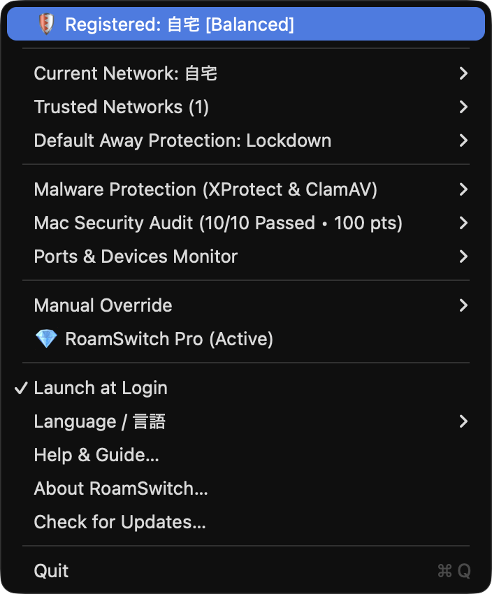

<!-- Language: **English** | [日本語](README.ja.md) -->

# RoamSwitch — Support & Announcements

**English** | [日本語](README.ja.md)

Autonomous network‑boundary security for your Mac. RoamSwitch is a menu‑bar app that
recognizes the networks you trust (home LAN, office, tethering, …) by their default
gateway MAC address and automatically switches the macOS firewall, stealth mode,
sharing services (SSH / SMB / Screen Sharing) and AirDrop policy the moment you move
between them.

> This repository is **not the source code**. It is the public home for
> **downloads, release notes, the FAQ, the privacy policy, and support** (bug reports
> and feature requests via [Issues](../../issues)).

<p align="center">
  
</p>

## Download

**https://lafine.net/**

- Signed & notarized `.dmg`, distributed outside the Mac App Store
- Requires **macOS 13 Ventura or later** (Apple silicon & Intel)
- Latest version: **1.7.1**

## What it does

| Layer | Free | Pro Lifetime |
| :--- | :---: | :---: |
| Wi‑Fi auto‑detection & kernel packet blocking (`pf`) | ✅ | ✅ |
| Per‑profile security levels (Trusted / Standard / Lockdown) | ✅ | ✅ |
| Auto stop & restore of SSH / SMB / Screen Sharing / AirDrop | ✅ | ✅ |
| Mac security health check (FileVault / SIP / Gatekeeper / updates) | ✅ manual | ✅ + autonomous background sweep |
| Malware tooling (XProtect / ClamAV status & scan) | ✅ manual | ✅ + auto virus‑definition updates |
| Wi‑Fi encryption‑strength warnings, ARP‑spoofing detection, exposed‑port & USB monitoring | ✅ | ✅ |
| 🚨 Ransomware‑like behavior detection → emergency Air‑Gap isolation (`pf`) | ❌ | 🚀 |
| 🛡️ Dev & Local AI server (Ollama/LM Studio etc.) `0.0.0.0` quarantine guard | ❌ (list only) | 🚀 one‑click block |
| 🕳️ Port‑anomaly guard — auto‑block newly exposed listening ports (signature‑free) | ❌ | 🚀 |
| ⚡ ARP‑spoofing auto‑containment + real‑time notifications | ❌ (menu only) | 🚀 |
| 🔌 Unauthorized USB / BadUSB storage guard + auto ClamAV scan on mount | ❌ | 🚀 |
| 🌐 Web/Mail download guard (incl. Pickle AI model detection), DNS threat protection, link‑safety auditor | ❌ | 🚀 |
| 🔑 API Key & Secret leak prevention checker (Zero Telemetry clipboard protection) | ✅ | ✅ |
| 📄 Log & diagnostics export (CSV / JSON) | ❌ | 🚀 |
| Devices | 1 | 2 |

## Pricing

One‑time purchase — no subscription.

| Plan | Price | Devices |
| :--- | :--- | :--- |
| **Free** | $0 | 1 |
| **Pro Lifetime** | **$19.99** | 2 |

Pro is a lifetime license with free updates. Purchase at **https://lafine.net/**.
Prices are shown in USD; checkout is billed in your local currency where supported.

## Privacy — Zero Telemetry

RoamSwitch performs **no external network communication of its own**: no analytics,
no crash reporting, no license "phone home" beyond the one‑time purchase checkout on
the website. The bundled MCP server is read‑only and speaks local stdio only. See
[docs/PRIVACY.md](docs/PRIVACY.md).

## MCP server (for Claude Desktop / Claude Code)

RoamSwitch ships a **read‑only** Model Context Protocol server so MCP clients can query
your Mac's security posture. No lockdown/quarantine/eject actions are exposed.

```sh
claude mcp add roamswitch /Applications/RoamSwitch.app/Contents/MacOS/RoamSwitchMCPServer
```

Tools: `get_security_report`, `get_exposed_ports`, `get_guard_status`, `audit_url_safety`,
`get_app_help`.

The server and the detection logic behind it are **open source** (MIT):
[github.com/lafine1211/roamswitch-mcp](https://github.com/lafine1211/roamswitch-mcp) —
`swift test` runs its unit, adversarial-input and mutation-fuzz suites.

## RoamSwitch for Linux

A separate edition for **Linux** (systemd + nftables) reproduces the same zero‑trust
model — autonomous `nftables` profile switching by gateway MAC, ransomware behaviour
detection with emergency Air‑Gap isolation, unauthorized‑USB / BadUSB guard, a 20‑item
security audit, and a read‑only MCP server.

- **Free — "Community Edition"**, every feature unlocked, no activation. Proprietary
  freeware (bundled EULA); the source is not published.
- **Download & docs:** <https://lafine.net/linux>
- **Install:** APT (`lafine.net/apt`), DNF / zypper (`lafine.net/rpm`), or AUR
  (`roamswitch-bin`). Requires Ubuntu 22.04+ / Debian 12+ or a compatible
  systemd + nftables distro; x86_64 / aarch64 (incl. Raspberry Pi 4 / 5).
- **Security whitepaper:** <https://lafine.net/linux/whitepaper>
  ([EN](https://lafine.net/linux/whitepaper.en)) — includes a code‑level audit of
  "zero data sent off the machine" and the destructive self‑test results
  ([audit/RESULTS-LINUX-2026-09-02.md](audit/RESULTS-LINUX-2026-09-02.md)).
- **RoamSwitch Business** (planned, paid) adds fleet management, signed policy
  distribution, a signed internal APT repository and SLA support for organizations:
  <https://lafine.net/business>. Holders of a macOS **Pro Lifetime** license get
  Business features free on their own Linux machines.
- **Support:** same [Issues](../../issues) tracker — please label Linux reports and
  attach `journalctl -u roamswitch -b` and `roamswitch status` output (redacted).

## Security & verification

- **Architecture & security whitepaper** — what privileges RoamSwitch holds and what it
  does at that boundary, at a level you can check against the shipping binary:
  [docs/WHITEPAPER.md](docs/WHITEPAPER.md) ([日本語](docs/WHITEPAPER.ja.md)) ·
  rendered at <https://lafine.net/security.html>
- **[`verify.sh`](verify.sh)** — runs the whitepaper's Appendix A checks against your
  installed copy (signature, notarization, entitlements, the MCP server's offline
  response, pf state). It's ~90 lines of read-only shell — read it first, then:

  ```sh
  git clone https://github.com/lafine1211/roamswitch-support && cd roamswitch-support
  ./verify.sh            # NO_SUDO=1 to skip the two sudo steps
  ```
- **[`audit/`](audit/)** — a heavier, repeatable **Zero Telemetry egress audit**:
  it captures traffic and attributes it per-process to check that the only
  outbound connections from RoamSwitch's binaries are the four documented in
  whitepaper §7. Latest run: [**PASS, 2026-08-29**](audit/RESULTS-2026-08-29.md).
  Reproduce with `./audit/rs-zerotel-audit.sh all`.
- Vulnerability reports: <https://lafine.net/.well-known/security.txt>

## Support

- **Bug reports & feature requests:** open an [Issue](../../issues) (templates provided)
- **Questions & discussion:** [Discussions](../../discussions)
- Release notes: [CHANGELOG.md](CHANGELOG.md) · Help: [docs/FAQ.md](docs/FAQ.md)

Japanese and English are both welcome in Issues.

## Links

- Website & download: https://lafine.net/
- [FAQ](docs/FAQ.md) · [Privacy Policy](docs/PRIVACY.md) · [Changelog](CHANGELOG.md)

---

RoamSwitch is proprietary software. © Lafine Systems Design. This repository's documentation may be
quoted for the purpose of discussing or supporting the app.
