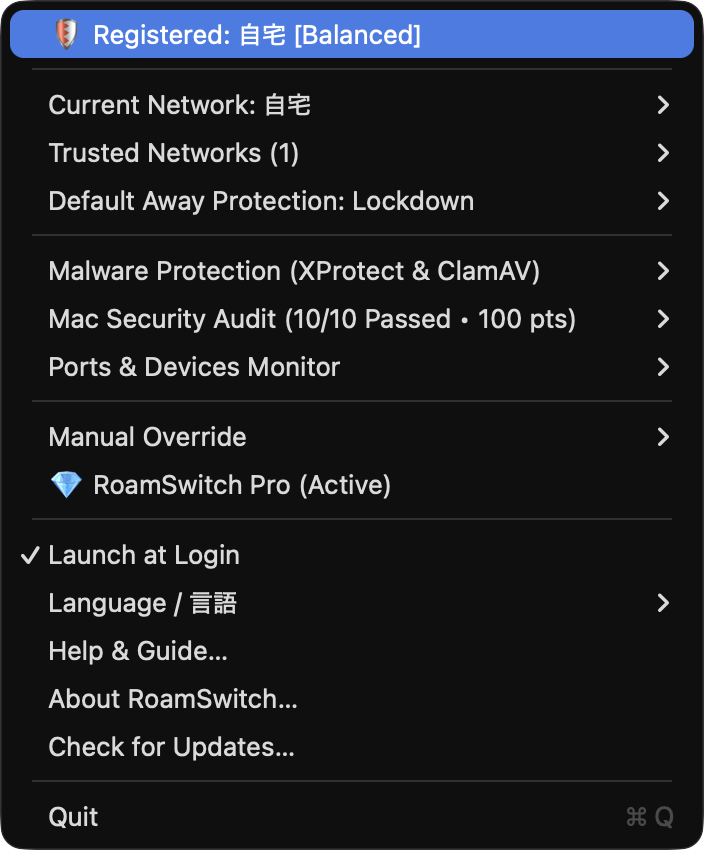

<!-- Language: **English** | [日本語](README.ja.md) -->

# RoamSwitch — Support & Announcements

**English** | [日本語](README.ja.md)

Autonomous network‑boundary security for your Mac. RoamSwitch is a menu‑bar app that
recognizes the networks you trust (home LAN, office, tethering, …) by their default
gateway MAC address and automatically switches the macOS firewall, stealth mode,
sharing services (SSH / SMB / Screen Sharing) and AirDrop policy the moment you move
between them.

> This repository is **not the source code**. It is the public home for
> **downloads, release notes, the FAQ, the privacy policy, and support** (bug reports
> and feature requests via [Issues](../../issues)).

<p align="center">
  
</p>

## Download

**https://roamswitch.com/**

- Signed & notarized `.dmg`, distributed outside the Mac App Store
- Requires **macOS 13 Ventura or later**, Apple silicon only (M1 / M2 / M3 / M4 and later)
- Latest version: **1.11.1**

## What it does

| Layer | Free | Pro Lifetime |
| :--- | :---: | :---: |
| Wi‑Fi auto‑detection & kernel packet blocking (`pf`) | ✅ | ✅ |
| Per‑profile security levels (Trusted / Standard / Lockdown) | ✅ | ✅ |
| Auto stop & restore of SSH / SMB / Screen Sharing / AirDrop | ✅ | ✅ |
| 18‑point Mac security health check (FileVault / SIP / Gatekeeper / updates / XProtect / firewall / stealth / Wi‑Fi / ARP / SSH / sudo / ports / download, DNS & link protection / USB & accessory guards) | ✅ manual | ✅ + autonomous background sweep |
| Malware tooling (XProtect / ClamAV status & scan) | ✅ manual | ✅ + auto virus‑definition updates |
| Wi‑Fi encryption‑strength warnings, ARP‑spoofing detection, exposed‑port & USB monitoring | ✅ | ✅ |
| 🚨 Ransomware‑like behavior detection → emergency Air‑Gap isolation (`pf`) | ❌ | 🚀 |
| 🛡️ Dev & Local AI server (Ollama/LM Studio etc.) `0.0.0.0` quarantine guard | ❌ (list only) | 🚀 one‑click block |
| 🕳️ Port‑anomaly guard — auto‑block newly exposed listening ports (signature‑free) | ❌ | 🚀 |
| ⚡ ARP‑spoofing auto‑containment + real‑time notifications | ❌ (menu only) | 🚀 |
| 🔌 Unauthorized USB / BadUSB storage guard + auto ClamAV scan on mount | ❌ | 🚀 |
| 🌐 Web/Mail download guard (incl. Pickle AI model detection), DNS threat protection, link‑safety auditor | ❌ | 🚀 |
| 🔑 API Key & Secret leak prevention checker (Zero Telemetry clipboard protection) | ✅ | ✅ |
| 🧬 Runtime threat containment — auto Air‑Gap the moment Apple's XProtect convicts a file | ❌ | 🚀 |
| 🪤 Ransomware canary (decoy bait files) with incident history | ❌ | 🚀 |
| 🔒 VPN tunnel + kill switch (WireGuard / Tailscale) on untrusted networks | ❌ | 🚀 |
| 🎣 Link guard — block phishing/scam destinations via `/etc/hosts` sinkhole + content‑filter extension | ❌ | 🚀 |
| 🧩 Persistence monitoring (new LaunchAgents/Daemons) & ClickFix shell‑history guard | ❌ | 🚀 |
| 📂 Critical Path FIM — SHA‑256 baseline of root‑only system files, checked in the background | ❌ | 🚀 |
| 🧾 Security log audit with automatic secret masking + log‑template anomaly detection | ✅ | ✅ |
| 🧯 Unified containment incident timeline & 7‑day notification history | ✅ | ✅ |
| 🐞 Local CVE matching for Homebrew formulae and dependency lockfiles (no network) | ✅ | ✅ |
| 🧪 Active vulnerability verification, `127.0.0.1` only (opt‑in, off by default) | ✅ | ✅ |
| 📄 Log & diagnostics export (CSV / JSON) | ❌ | 🚀 |
| Devices | 1 | 2 |

## Pricing

One‑time purchase — no subscription.

| Plan | Price | Devices |
| :--- | :--- | :--- |
| **Free** | $0 | 1 |
| **Pro Lifetime** | **$19.99** | 2 |

Pro is a lifetime license with free updates. Purchase at **https://roamswitch.com/**.
Prices are shown in USD; checkout is billed in your local currency where supported.

## Privacy — Zero Telemetry

RoamSwitch has **no telemetry**: it does not collect or send usage data, diagnostic
results, analytics or crash reports. It does make the minimal connections its features
need, which are published in the design document and the
[Privacy Policy](https://lafine.net/privacy.html). In the Mac app they are:

- the update check (the Sparkle appcast, at launch and every 24 hours, all users)
- license activation (only when you enter a key)
- the link guard's signed threat feed (Pro)
- package CVE data (all users, fetched about once every 30 days)
- ClamAV definition updates (Pro, automatic)
- the DNS threat guard, which switches the system DNS resolver (Pro)
- only when you use them: expanding a short URL in the Link Safety sheet (the request
  goes directly to the target URL), the Sensor and VPN features, and the npm signature check

Purchase checkout happens on the website. The bundled MCP server is read‑only and speaks
local stdio only (its own network behavior is described in the MCP section below). The last
egress measurement in [`audit/`](audit/) was made on version 1.4.7 on 2026-08-29 and predates
several of these paths.

On Linux, the Server Edition makes no external connection by default other than OS package
updates and a signed, receive‑only, anonymous HTTPS GET to lafine.net for the kernel CVE map (the manifest is
checked daily and the data fetched about every 30 days; on by default since 1.11.0; nothing about the host is sent; turn it off with
`roamswitch server config set cve_kernel_map_updates_enabled false`). Other external
communications, such as the npm signature check and notification webhooks, are on only when
an operator sets them up.

## MCP server (for Claude Desktop / Claude Code)

RoamSwitch ships a **read‑only** Model Context Protocol server so MCP clients can query
your Mac's security posture. No lockdown/quarantine/eject actions are exposed.

```sh
claude mcp add roamswitch /Applications/RoamSwitch.app/Contents/MacOS/RoamSwitchMCPServer
```

31 tools, all read‑only: `get_security_report`, `verify_security_findings`, `get_exposed_ports`,
`get_guard_status`, `audit_url_safety`, `audit_secrets`, `audit_security_logs`, `get_app_help`,
`run_active_vuln_scan`, `run_package_cve_scan`, `run_package_cve_scan_languages`,
`run_package_lifecycle_script_scan`, `run_typosquat_scan`, `run_npm_audit_signatures`,
`get_vulnerability_scan_history`, `get_quarantine_status`, `get_canary_status`,
`get_ransomware_entropy_guard_status`, `get_ransomware_recovery_snapshots`,
`get_forensic_evidence_bundles`, `get_honeytoken_status`, `get_browser_credential_watch_status`,
`get_port_anomaly_incidents`, `get_runtime_threat_status`, `get_incident_timeline`,
`search_exec_events`, `get_process_tree`, `get_network_history`, `get_sensor_audit_results`,
`get_notification_history`, `audit_mcp_configs` — plus four `roamswitch://docs/*` resources. The incident‑state
tools read only local state, so they still answer while RoamSwitch has air‑gapped the network.
`verify_security_findings` re‑evaluates items of `get_security_report` (by `checkId`) against the
current state and returns, per item, `stillPresent`, `resolved` or `inconclusive` with a
language‑independent reason code, so you can confirm a fix actually worked. An item that could
not be measured (missing permission, privileged helper not connected, Docker unreachable) is
reported as `inconclusive`, never as safe. `host_firewall`, `network_stealth_mode`,
`gateway_arp_lock`, `malware_scanning`, `dns_threat_guard` and `usb_zero_trust` are decided by
RoamSwitch's in‑app settings, so they reflect those settings and are not a re‑measurement of the
actual OS state. It is read‑only and neither repairs anything nor changes any setting.

Network behavior of the MCP server: it does not connect to external hosts. On Mac, the
diagnostic tools may send an ICMP ping to the gateway on your LAN to identify its MAC address
(normally one, up to three if the MAC cannot be resolved). On Linux, evaluating a diagnosis
(`get_security_report`, `verify_security_findings`) sends nothing to the LAN: the MAC address comes
only from the ARP/neighbor tables and the in‑memory cache. (Linux sends a ping only in emergency
restore and Sensor pairing.) The only tool
that talks to an external host is `run_npm_audit_signatures` (the npm registry), which is opt‑in
and Pro‑only. `run_active_vuln_scan` only probes `127.0.0.1`, and `get_exposed_ports` sends one
HTTP `GET` to `127.0.0.1` per exposed port to check its headers.
Setup for Claude Desktop, Claude Code, Codex CLI, OpenCode and Antigravity:
<https://roamswitch.com/mcp-setup.html>.

The server and the detection logic behind it are **open source** (MIT):
[github.com/lafine1211/roamswitch-mcp](https://github.com/lafine1211/roamswitch-mcp) —
`swift test` runs its unit, adversarial-input and mutation-fuzz suites.

## RoamSwitch for Linux

A separate edition for **Linux** (systemd + nftables) reproduces the same zero‑trust
model — autonomous `nftables` profile switching by gateway MAC, ransomware behaviour
detection with emergency Air‑Gap isolation, unauthorized‑USB / BadUSB guard, a VPN tunnel
with an nftables kill switch (WireGuard / Tailscale), a passive link guard, local CVE
matching, a 27‑item security audit, a full CLI (`roamswitch`, `man roamswitch`) and a
read‑only MCP server with 36 tools.

There are two mutually exclusive packages: **Client Edition** (`roamswitch`, tray app +
web UI, 27‑item audit) and **Server Edition** (`roamswitch-server`, fully headless for
cloud VPS/data centers — inbound default drop with SSH lockout prevention, Critical Path
FIM, eBPF intrusion detection via Falco or Tetragon with autonomous containment, a
resource‑exhaustion guard, Telegram/LINE/webhook alerts, and a 33‑item audit).

- **Free — "Community Edition"**, every feature unlocked, no activation. Proprietary
  freeware (bundled EULA); the source is not published.
- **Download & docs:** <https://roamswitch.com/linux>
- **Install:** APT (`lafine.net/apt`) or DNF / zypper (`lafine.net/rpm`); on Arch,
  build from the bundled PKGBUILD (the AUR package `roamswitch-bin` is pending).
  Requires Ubuntu 22.04+ / Debian 12+ or a compatible systemd + nftables distro;
  x86_64 / aarch64 (incl. Raspberry Pi 4 / 5).
- **Docs:** [CLI / headless operations](https://roamswitch.com/linux-cli.html) ·
  [Server Edition manual](https://roamswitch.com/linux/server-manual) ·
  [Server Edition whitepaper](https://roamswitch.com/linux/server-whitepaper)
- **Rust SDK (MIT):** [roamswitch-linux-kit](https://github.com/lafine1211/roamswitch-linux-kit)
- **Security whitepaper:** <https://roamswitch.com/linux/whitepaper>
  ([EN](https://lafine.net/linux/whitepaper.en)) — includes a code‑level audit of
  "zero data sent off the machine" and the destructive self‑test results
  ([audit/RESULTS-LINUX-2026-09-02.md](audit/RESULTS-LINUX-2026-09-02.md)).
- **RoamSwitch Business** (planned, paid) adds fleet management, signed policy
  distribution, a signed internal APT repository and SLA support for organizations:
  <https://roamswitch.com/business>. The policy is that holders of a macOS
  **Pro Lifetime** license get Business features free on their own Linux machines once the
  Business tier becomes available (it is not offered yet).
- **Support:** same [Issues](../../issues) tracker — please label Linux reports and
  attach `journalctl -u roamswitch -b` and `roamswitch status` output (redacted).

## Security & verification

- **Architecture & security whitepaper** — what privileges RoamSwitch holds and what it
  does at that boundary, at a level you can check against the shipping binary:
  <https://roamswitch.com/security.html> (English/日本語, switchable on the page)
- **[`verify.sh`](verify.sh)** — runs the whitepaper's Appendix A checks against your
  installed copy (signature, notarization, entitlements, the MCP server's offline
  response, pf state). It's ~90 lines of read-only shell — read it first, then:

  ```sh
  git clone https://github.com/lafine1211/roamswitch-support && cd roamswitch-support
  ./verify.sh            # NO_SUDO=1 to skip the two sudo steps
  ```
- **[`audit/`](audit/)** — a heavier, repeatable **Zero Telemetry egress audit**:
  it captures traffic and attributes it per-process to check that the only
  outbound connections from RoamSwitch's binaries are the four documented in
  whitepaper §7. Latest run: [**PASS, 2026-08-29**](audit/RESULTS-2026-08-29.md)
  (RoamSwitch 1.4.7; later versions have more paths, listed in "Privacy" above).
  Reproduce with `./audit/rs-zerotel-audit.sh all`.
- **[`test/docker/`](test/docker/)** — reproducible Docker test suite for the seven public attack
  scenarios (PENT-1 to 7: Air-Gap enforcement, self-healing against firewall clobbering,
  `/tmp` noexec, Yama LSM, ransomware canary tampering, IP spoofing and SYN flood resistance,
  homograph detection and credential leak detection; at most 17 individual checks). Network
  and file changes stay inside the container's own network and mount namespaces, but the
  container runs with `--privileged`, so settings shared by the whole kernel (for example
  Yama's `ptrace_scope`) also change on the host. Run it in a disposable environment:

  ```sh
  cd test/docker
  docker build -t roamswitch-test .
  docker run --rm --privileged roamswitch-test
  ```
- Vulnerability reports: <https://lafine.net/.well-known/security.txt>

## Support

- **Bug reports & feature requests:** open an [Issue](../../issues) (templates provided)
- **Questions & discussion:** [Discussions](../../discussions)
- Release notes: [CHANGELOG.md](CHANGELOG.md) · Help: [FAQ](https://roamswitch.com/faq.html)

Japanese and English are both welcome in Issues.

## Links

- Website & download: https://roamswitch.com/
- [FAQ](https://roamswitch.com/faq.html) · [Privacy Policy](https://lafine.net/privacy.html) · [Changelog](CHANGELOG.md) · [If development stops](CONTINUITY.md)

---

RoamSwitch is proprietary software. © Lafine Systems Design. This repository's documentation may be
quoted for the purpose of discussing or supporting the app.
